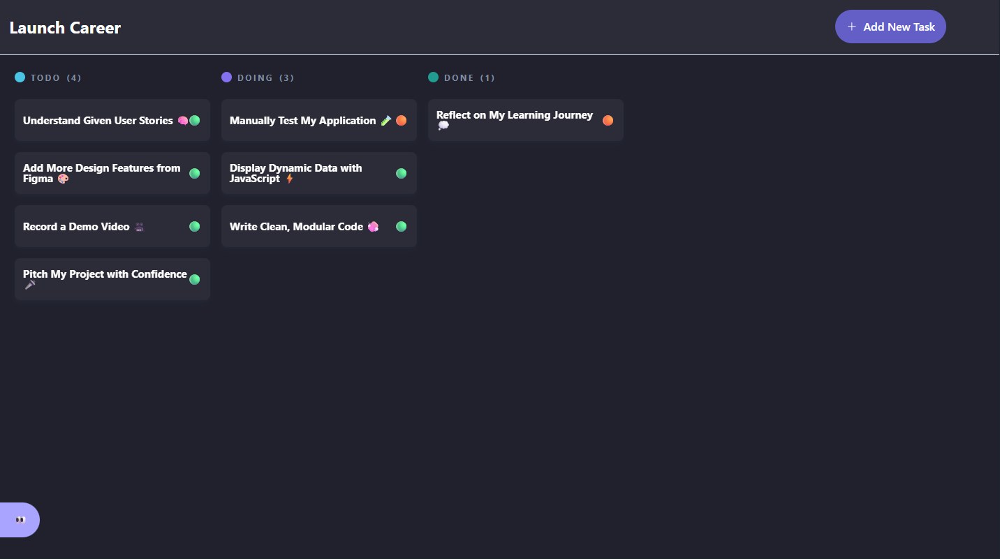
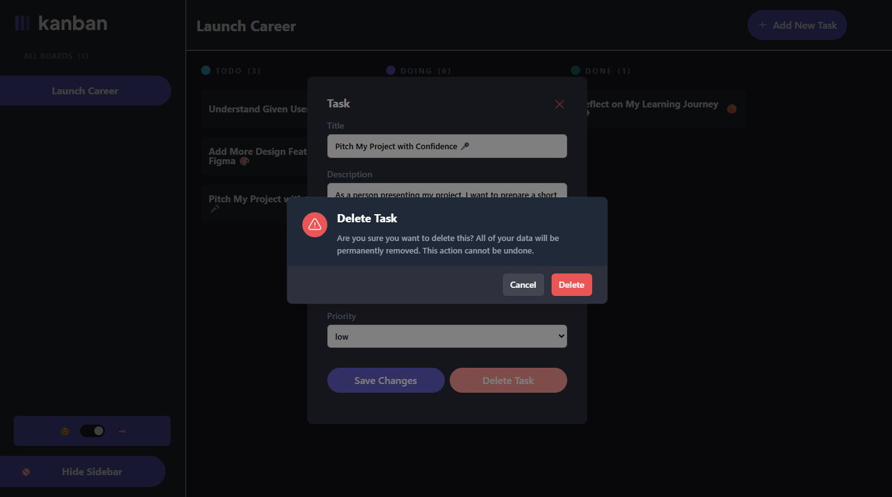

# JSL Portfolio Piece: Kanban App Deployment & Features Implementation

## Overview

This project involves **deploying a Kanban app to Netlify**, ensuring the app's functionality and persistence through local storage, and implementing dynamic features such as:
- task editing, 
- deletion, 
- sidebar interaction, and a 
- theme toggle. 

The goal was to deliver a fully functional, deployable application that is responsive across devices and maintains data consistency.  

I also focused on **clean, modular code** that is well-documented for future development.

## My Submition Links

- **Recorded Presentation:** A **5-10 minutes** of my [My Loom Presentaion](https://www.loom.com/).
- **Deployment Link**: [My Netlify Kanban app](https://sips-kanban-task-management-board.netlify.app/).

## Resources
My Implementation is based on the:
- [Figma Reference File](https://www.figma.com/design/y7bFCUYL5ZHfPeojACBXg2/Challenges-%7C-JSL?node-id=6033-11092&t=XbQhBWPYxXDAqp3x-1) 
- **Project user stories** which are highlighted below:

## Key Objectives

### Set up, Deployment & Hosting
To successfully run this project, I included the following installations and dependencies.

##### Set up
1. Install node.js
2. Install tailwind css
3. install Live extensition

##### List of technologies

- HTML
- Tailwind CSS
- Javascript
- Netlify

##### Project Set up

your-project-folder/
├── index.html
├── scripts/
│   ├── main.js
├── styles/
│   └── style.css

##### Deployment & Hosting

- I **Prepare the Kanban app files** for deployment, ensuring the project structure aligns with best practices for deployment.
- I then **Deployed the Kanban app to Netlify**, following the process of uploading your project and setting a custom deployment link.
- I finally tested the deployed app to ensure that all features, including 
  - task creation, 
  - editing, 
  - local storage, and 
  - sorting, work as expected in a live environment.

### Project user stories run through

#### P2.9 - P2.11. Initial Data Fetching & Loading State

- I **Fetched tasks dynamically** from an API: https://jsl-kanban-api.vercel.app/

- I **Replaced any hard-coded task data**, to ensure the application receives the most up-to-date tasks.

- I **Displayed a loading message** while the tasks are being fetched so that users are informed the data is loading.
- If fetching fails, I **showed an error message** to alert users to the issue.

#### P2.12 - P2.13 Data Persistence

- I **Stored the fetched tasks in local storage** to ensure data persists across page reloads.
- On startup, I **load tasks from local storage** and display them in their respective columns (To Do, Doing, Done) to maintain an organized task board.

#### P2.14 - P2.17 Task Editing & Deletion

- Users can **edit task details** (title, description, status) in a modal. Upon saving, the task reflects the updated data on the board and in local storage.
- I also Implemented a **delete button** within the modal to allow users to remove tasks. A confirmation message should appear before deleting a task, and if confirmed, the task is removed from both the task board and local storage.

#### P2.22 - P2.24 Sidebar Interaction

- I then Implemented a **sidebar** that contains all required elements as shown in the Figma design.
- I ensured the sidebar to be **toggleable**, so users can hide or show it based on their preferences.
- I also implemented a mobile version of the sidebar that can be **accessed from the app logo**, and I ensured it matches the design and functionality of the desktop sidebar.

#### P2.25 - P2.27 Mobile Sidebar (Menu) Functionality

- On mobile, the sidebar functions as a **menu** accessible from the top of the screen.
- I include the **theme toggle** switch in the mobile menu and ensure all features match the desktop sidebar, as shown in the Figma design.
- I ensured that the mobile menu is **closable**, allowing users to dismiss it for an unobstructed view of the tasks.

#### P2.28 - P2.31 Theme Toggle (Dark/Light Mode)

- I included a **theme toggle switch** to allow users to switch between dark mode and light mode.
- The toggle is functional in both the **desktop sidebar** and the **mobile menu** for consistent theme switching across devices.
- All elements of the **Kanban board** are styled appropriately in dark mode, ensuring good contrast and readability.

### P2.25 - P2.43 Stretch Goal: Adding Priority (Optional)

I then enhance my task management application by introducing a **priority system**. Users are able to select a priority level—**High, Medium, or Low**—when creating or editing tasks. The priority are:

- **Visually displayed** on each task card as shown on the Figma design to clearly communicate urgency.
- They are **saved to local storage** to ensure persistence across page reloads.
- These are **editable** so users can adjust a task's importance as needed.
- Upon changes or edits, It is**reflected immediately** on the UI.
- The tasks are **sorted automatically** within each status column by priority (High → Medium → Low), with **High-priority tasks appearing at the top**.
- The tasks are **persistently ordered**, maintaining correct priority display after refreshing the page.

## Code Quality & Maintainability

- I then **Broke the code into separate modules** with clear responsibilities
  - local storage handling, 
  - task rendering, 
  - modal management to improve maintainability and scalability.
- Use **descriptive, meaningful variable and function names** to make the code easy to understand.
- **Document every major function and module** using **JSDoc comments** to explain the purpose, parameters, and return values of each part of the code.

## Expected Outcome

A fully functional Kanban app that:

- Dynamically fetches and displays tasks.
- Supports task editing, deletion, and persistent storage through local storage.
- Has a responsive, mobile-friendly sidebar with a theme toggle switch.
- App deployed to **Netlify** with a custom, readable URL.
- Uses modular, well-documented code that is easy to maintain and scale.

### Desktop view Toggle (Light mode & Dark mode)

### Desktop view Hide Sidebar (Light mode & Dark mode)

### Desktop view Add New task (Light mode & Dark mode)

### Desktop view Edit task (Light mode & Dark mode)

### Desktop Delete task (Light mode & Dark mode)

### Mobile view Toggle (Light mode & Dark mode)

### Mobile view top Sidebar (Light mode & Dark mode)

### Mobile view Add New task (Light mode & Dark mode)

### Mobile view Edit task (Light mode & Dark mode)

### Mobile Delete task (Light mode & Dark mode)

